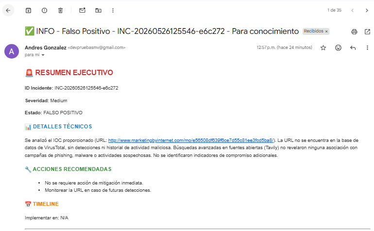

# SOC Multi-Agent System

Sistema automatizado de Security Operations Center (SOC) impulsado por inteligencia artificial con arquitectura multi-agente. Recibe alertas de seguridad, las analiza, determina su gravedad y envía notificaciones profesionales por correo electrónico.

## Arquitectura

```
Alerta de seguridad (Webhook/Dashboard)
        │
        ▼
┌───────────────────┐
│ Supervisor Agent  │  (Orquestador)
└───────────────────┘
        │
        ▼
┌───────────────────┐
│ Alert Analyzer    │  → VirusTotal + Tavily (análisis de IOCs)
└───────────────────┘
        │
        ▼ (solo si es TRUE POSITIVE)
┌───────────────────┐
│ Threat Analyzer   │  → Clasifica severidad, identifica TTPs, propone mitigaciones
└───────────────────┘
        │
        ▼
┌───────────────────┐
│ Notification Agent│  → Envía email HTML con informe completo vía Gmail API
└───────────────────┘
```

## Tecnologías

- **Python 3.13**
- **LangGraph + LangGraph Supervisor** — orquestación de agentes
- **Groq** (`openai/gpt-oss-120b`) — LLM para todos los agentes
- **VirusTotal API** — escaneo de IPs, URLs y hashes
- **Tavily** — búsqueda web para contexto de amenazas
- **Gmail API** — envío de notificaciones por correo
- **Streamlit** — dashboard web
- **FastAPI + Uvicorn** — servidor webhook

## Estructura del proyecto

```
soc_multiagente/
├── agents.py            # Definición de los 3 agentes (ReAct)
├── config.py            # Carga y validación de configuración
├── dashboard.py         # Dashboard Streamlit
├── supervisor.py        # Orquestador supervisor + flujo de trabajo
├── tools.py             # Herramientas (VirusTotal, Tavily, Gmail)
├── webhook_server.py    # Servidor FastAPI (webhook REST)
├── requirements.txt     # Dependencias Python
├── .env                 # Variables de entorno (API keys)
├── credentials/         # OAuth2 credentials de Google
│   ├── credentials.json
│   └── token.json
└── screenshots/         # Capturas de pantalla
```

## Requisitos

- Python 3.13+
- Claves API de:
  - [Groq](https://console.groq.com)
  - [Tavily](https://tavily.com)
  - [VirusTotal](https://www.virustotal.com/gui/join)
- (Opcional) Proyecto en Google Cloud con Gmail API habilitada

## Instalación

```bash
# Clonar el repositorio
git clone <url-del-repo>
cd soc_multiagente

# Crear y activar entorno virtual
python -m venv venv
# Windows:
.\venv\Scripts\activate
# Linux/Mac:
# source venv/bin/activate

# Instalar dependencias
pip install -r requirements.txt
```

## Configuración

Crear un archivo `.env` en la raíz del proyecto:

```env
# API Keys (obligatorias)
GROQ_API_KEY="gsk_tu_clave_groq"
TAVILY_API_KEY="tvly-tu_clave_tavily"
VIRUSTOTAL_API_KEY="tu_clave_virustotal"

# Gmail (opcional — necesario para enviar correos)
GOOGLE_APLICATION_CREDENTIALS="C:\ruta\a\credentials.json"
GMAIL_TOKEN="C:\ruta\a\token.json"

# Configuración SOC
SOC_EMAIL_RECIPIENT="soc@example.com"
SOC_EMAIL_SENDER="soc@example.com"
```

### Configurar Gmail (para notificaciones por correo)

1. Crear un proyecto en [Google Cloud Console](https://console.cloud.google.com)
2. Habilitar la **Gmail API**
3. Crear credenciales OAuth 2.0 (tipo "Aplicación de escritorio")
4. Descargar `credentials.json` y colocarlo en la carpeta `credentials/`
5. Ejecutar la aplicación una vez para generar `token.json` mediante el flujo OAuth

## Ejecución

El sistema se ejecuta como **dos procesos**:

### Terminal 1 — Servidor webhook (FastAPI)

```bash
python webhook_server.py
```

Servidor en `http://localhost:8000`

| Endpoint | Método | Descripción |
|---|---|---|
| `/webhook/alert` | POST | Enviar alerta de seguridad |
| `/incidents` | GET | Listar incidentes procesados |
| `/health` | GET | Health check |
| `/api-status` | GET | Estado de las APIs configuradas |

### Terminal 2 — Dashboard (Streamlit)

```bash
streamlit run dashboard.py
```

Dashboard en `http://localhost:8501`

### Enviar una alerta de prueba

```bash
curl -X POST http://localhost:8000/webhook/alert \
  -H "Content-Type: application/json" \
  -d '{
    "source": "siem",
    "alert_type": "Malware Detection",
    "severity": "High",
    "message": "Hash sospechoso detectado en endpoint",
    "source_ip": "203.0.113.50",
    "file_hash": "e3b0c44298fc1c149afbf4c8996fb92427ae41e4649b934ca495991b7852b855",
    "email_recipient": "soc-team@example.com"
  }'
```

## Flujo de procesamiento

1. **Alert Analyzer** — Extrae IOCs (IPs, URLs, hashes), los consulta en VirusTotal, investiga contexto con Tavily y determina si es **TRUE POSITIVE** o **FALSE POSITIVE**
2. **Threat Analyzer** — Si es verdadero positivo, clasifica severidad (CRITICAL/HIGH/MEDIUM/LOW), identifica TTPs (MITRE ATT&CK) y propone mitigaciones
3. **Notification Agent** — Envía un correo HTML profesional con el informe completo del incidente

## Capturas

| Dashboard | Correo de notificación |
|---|---|
|  |  |

## Seguridad

- No commitees el archivo `.env` ni `credentials/token.json`
- Añade un `.gitignore` con al menos:

```
.env
venv/
__pycache__/
*.pyc
credentials/token.json
```

## Licencia

MIT
